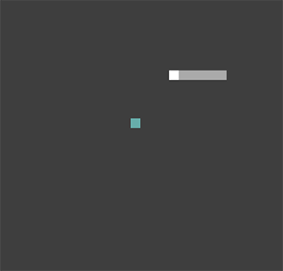

# Scala Snake

This workshop leads participants in building a simple Snake game that runs in
the browser.  It uses Scala 3 and Scala.js and looks like this:

## Requirements

 - 1 workshop leader.
 - 0 or more mentors according to the number of participants
 - sbt + nodejs setup

## Part 1: Getting started

Leader makes a small presentation to introduce:

 - the Scala knowledge needed to complete the workshop
 - the basics of the game: the grid system, eating, borders, moving

## Part 2: Coding

Participants receive the template for the project.
The empty template compiles and renders something.

The Leader tells to the participants in what order to fill in the blanks,
waits some time for each part. At the end stuck participants are helped.

## Part 3: Expansions

Participants can work on expansions (more in `Snake.scala`). Mentors answer
questions.
